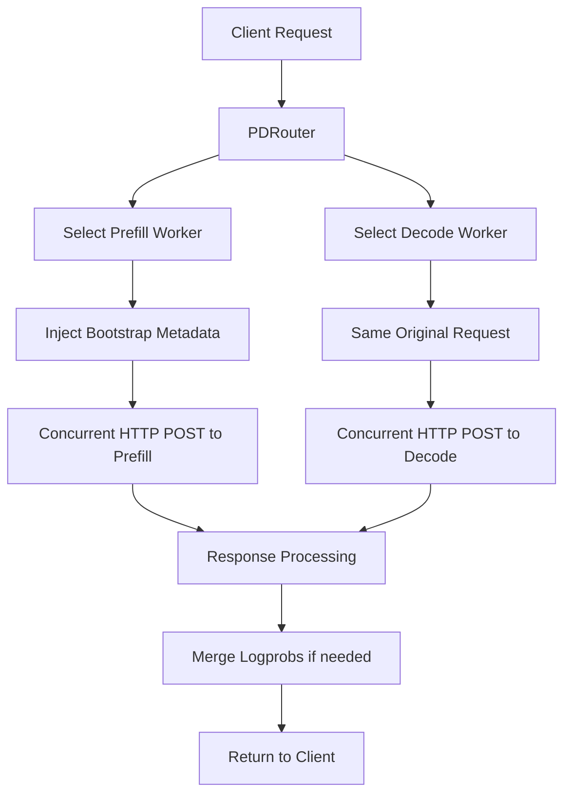
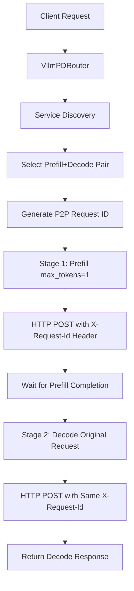

# VLLM vs vLLM Prefill/Decode Coordination Analysis

## Overview
This document compares how VLLM and vLLM handle prefill/decode disaggregated serving coordination through their respective routers.

## 1. VLLM P/D Coordination Mechanism

### Architecture
- **Router Type**: `PDRouter` (prefill-decode router)
- **Coordination Pattern**: Concurrent dual dispatch
- **Communication**: Direct HTTP requests to both servers simultaneously

### Request Flow


### Key Characteristics

#### 1. **Concurrent Execution**
```rust
// Both requests sent simultaneously
let (prefill_result, decode_result) =
    tokio::join!(prefill_request.send(), decode_request.send());
```

#### 2. **Bootstrap Coordination**
- **Prefill Request**: Injects `bootstrap_host`, `bootstrap_port`, `bootstrap_room`
- **Decode Request**: Receives original request unchanged
- **Coordination**: VLLM servers coordinate via bootstrap TCP connection

#### 3. **Request Modification**
```rust
// Bootstrap metadata injection for prefill
obj.insert("bootstrap_host", Value::from(hostname));
obj.insert("bootstrap_port", match bootstrap_port {
    Some(v) => Value::from(v),
    None => Value::Null,
});
obj.insert("bootstrap_room", Value::from(generate_room_id()));
```

#### 4. **Response Handling**
- **With Logprobs**: Wait for both responses, merge logprob data
- **Without Logprobs**: Fire-and-forget prefill, return decode response
- **Streaming**: Direct passthrough from decode server

## 2. vLLM P/D Coordination Mechanism

### Architecture
- **Router Type**: `VllmPDRouter` (vLLM prefill-decode router)
- **Coordination Pattern**: Sequential two-stage processing
- **Communication**: ZMQ P2P NCCL coordination

### Request Flow


### Key Characteristics

#### 1. **Sequential Execution**
```rust
// Stage 1: Prefill with max_tokens=1
let prefill_response = send_to_prefill(prefill_request).await?;
// Stage 2: Decode with original request
let decode_response = send_to_decode(original_request).await?;
```

#### 2. **P2P Coordination via Headers**
```rust
// Complex request ID in header for P2P coordination
let request_id = format!(
    "___prefill_addr_{}___decode_addr_{}_{}",
    prefill_zmq_addr, decode_zmq_addr, uuid
);
.header("X-Request-Id", &request_id)
```

#### 3. **Request Modification**
```rust
// Prefill stage: Force prefill-only mode
prefill_request["max_tokens"] = Value::Number(1);
prefill_request["max_completion_tokens"] = Value::Number(1);

// Decode stage: Original request unchanged
decode_request = original_request;
```

#### 4. **Service Discovery**
- **Dynamic Worker Registration**: Workers register via ZMQ MessagePack
- **Pure Service Discovery**: No static worker configuration needed
- **ZMQ Coordination**: Workers establish P2P NCCL connections

## 3. Detailed Comparison

| Aspect | VLLM P/D | vLLM P/D |
|--------|------------|----------|
| **Execution Pattern** | Concurrent (both requests simultaneously) | Sequential (prefill → decode) |
| **Coordination Method** | Bootstrap TCP connection | ZMQ P2P NCCL |
| **Request ID Location** | Bootstrap metadata in JSON body | X-Request-Id HTTP header |
| **Prefill Request** | Original request + bootstrap metadata | max_tokens=1 (prefill-only) |
| **Decode Request** | Original request unchanged | Original request unchanged |
| **Worker Discovery** | Static configuration | Dynamic ZMQ service discovery |
| **P2P Communication** | TCP bootstrap connection | ZMQ + NCCL |
| **Response Handling** | Merge responses if logprobs needed | Return decode response only |
| **Streaming Support** | Direct passthrough from decode | Direct passthrough from decode |

## 4. Request Format Examples

### VLLM P/D Request Format

#### To Prefill Server:
```json
{
  "messages": [{"role": "user", "content": "Hi"}],
  "model": "meta-llama/Meta-Llama-3.1-8B",
  "max_tokens": 5,
  "bootstrap_host": "10.0.1.70",
  "bootstrap_port": 8080,
  "bootstrap_room": "room_abc123"
}
```

#### To Decode Server:
```json
{
  "messages": [{"role": "user", "content": "Hi"}],
  "model": "meta-llama/Meta-Llama-3.1-8B",
  "max_tokens": 5
}
```

### vLLM P/D Request Format

#### Stage 1 - To Prefill Server:
```http
POST /v1/chat/completions
X-Request-Id: ___prefill_addr_10.0.1.70:21001___decode_addr_10.0.1.70:22001_abc123
Content-Type: application/json

{
  "messages": [{"role": "user", "content": "Hi"}],
  "model": "meta-llama/Meta-Llama-3.1-8B",
  "max_tokens": 1
}
```

#### Stage 2 - To Decode Server:
```http
POST /v1/chat/completions
X-Request-Id: ___prefill_addr_10.0.1.70:21001___decode_addr_10.0.1.70:22001_abc123
Content-Type: application/json

{
  "messages": [{"role": "user", "content": "Hi"}],
  "model": "meta-llama/Meta-Llama-3.1-8B",
  "max_tokens": 5
}
```

## 5. Coordination Protocols

### VLLM Bootstrap Protocol
1. **Router** injects bootstrap metadata into prefill request
2. **Prefill Server** extracts bootstrap info, establishes TCP connection to decode server
3. **Decode Server** accepts bootstrap connection, shares KV cache
4. **Both Servers** process simultaneously, share state via TCP
5. **Router** merges responses if needed

### vLLM P2P NCCL Protocol
1. **Router** generates P2P request ID with ZMQ addresses
2. **Prefill Server** extracts decode ZMQ address from X-Request-Id header
3. **Prefill Server** processes request, establishes NCCL connection to decode
4. **Decode Server** receives same X-Request-Id, accepts NCCL connection
5. **Decode Server** processes request using transferred KV cache
6. **Router** returns final decode response

## 6. Key Architectural Differences

### VLLM: Orchestrator Pattern
- Router acts as **central orchestrator**
- Manages coordination between servers
- Handles response merging and error handling
- Bootstrap metadata embedded in request payload

### vLLM: P2P Coordination Pattern
- Router acts as **request distributor**
- Servers coordinate directly via P2P protocols
- ZMQ service discovery for dynamic scaling
- Coordination metadata in HTTP headers

## 7. Performance Implications

### VLLM P/D
- **Pros**: Lower latency (concurrent execution), simpler coordination
- **Cons**: Router complexity, bootstrap TCP overhead, static configuration

### vLLM P/D
- **Pros**: Dynamic scaling, P2P efficiency, service discovery flexibility
- **Cons**: Higher latency (sequential stages), complex P2P setup, ZMQ dependencies

## 8. Implementation Complexity

### VLLM P/D Router
- **Request Processing**: Moderate complexity (bootstrap injection, response merging)
- **Worker Management**: Simple (static configuration)
- **Error Handling**: Complex (dual response coordination)

### vLLM P/D Router
- **Request Processing**: Simple (header-based coordination)
- **Worker Management**: Complex (service discovery, ZMQ)
- **Error Handling**: Simple (single response path)

## Conclusion

Both approaches represent different philosophies:

- **VLLM**: Centralized orchestration with concurrent execution for performance
- **vLLM**: Distributed P2P coordination with dynamic service discovery for scalability

The choice depends on deployment requirements:
- **VLLM P/D**: Better for latency-sensitive applications with stable worker configurations
- **vLLM P/D**: Better for dynamic scaling scenarios and cloud-native deployments